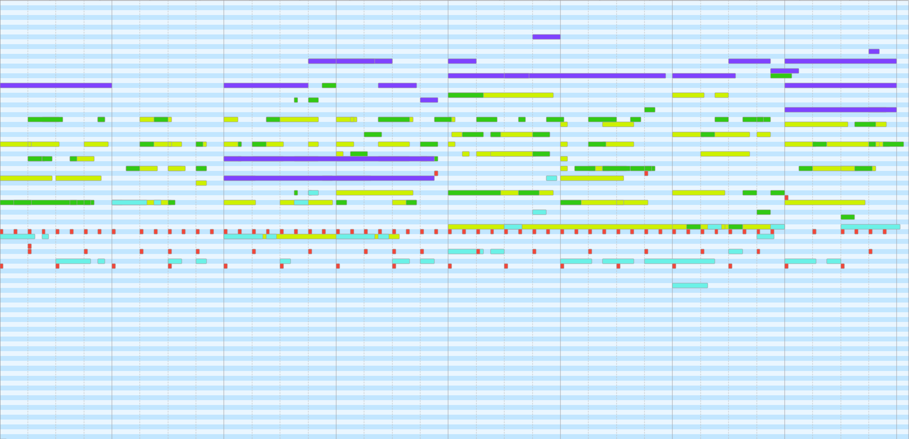
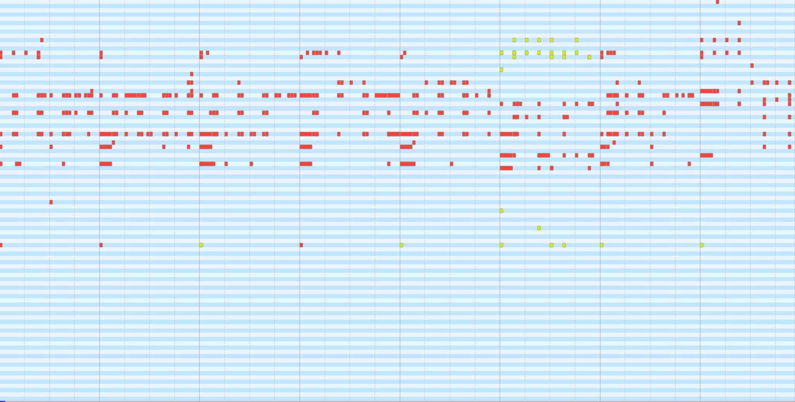
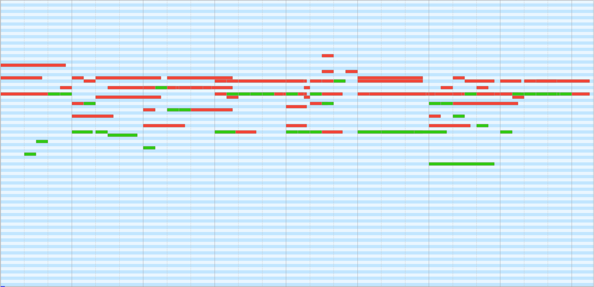
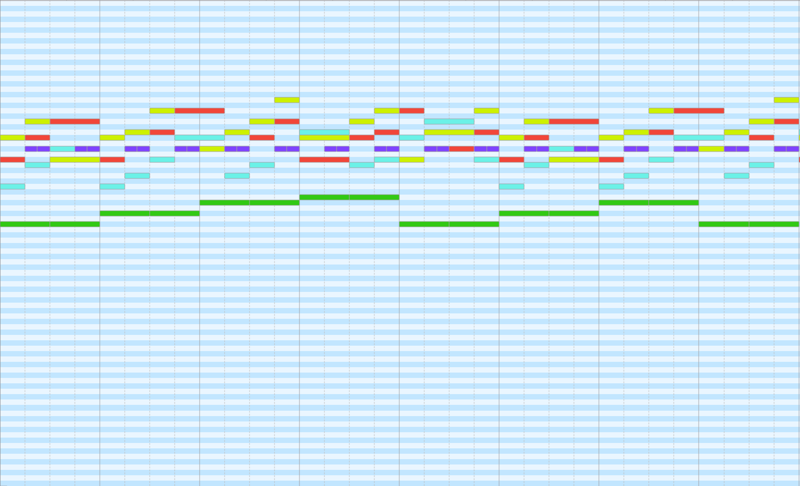
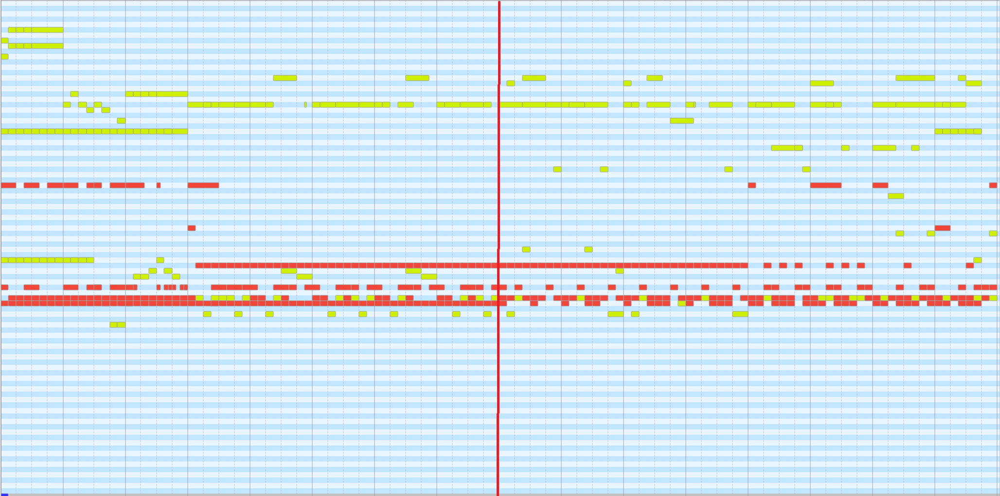
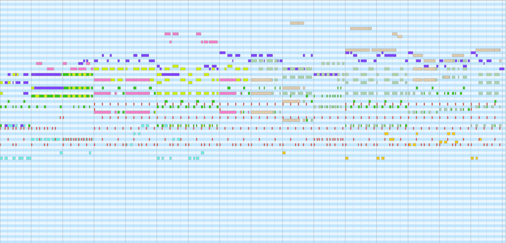
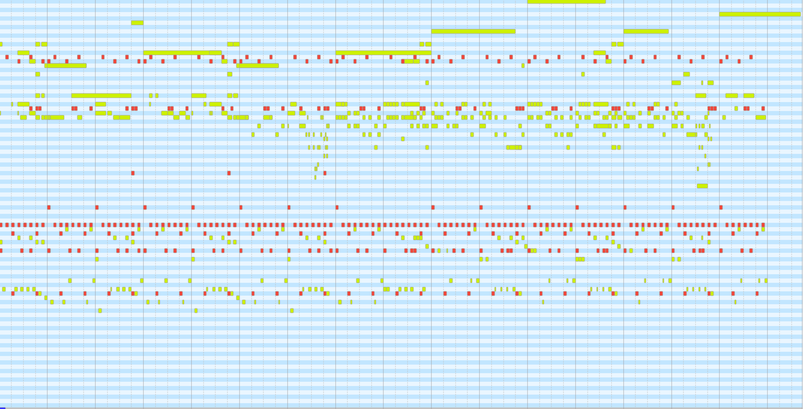

# Diff-Symbo: Text-Controlled Long-Duration Symbolic Music Generation Using Latent Diffusion Model with Autoregressive Approach

<h2 id = "1">Abstract</h2>
Text-controlled symbolic music generation has recently gained research attention due to its versatile, flexible and straightforward approach to music composition. However, previous approaches tend to generate symbolic music with compromising quality, diversity, controllability and limited duration. In this paper, we present Diff-Symbo, an innovative method that uses latent diffusion model (LDM) to generate high-quality, diverse and long-duration symbolic music. To address the lack of text-symbolic music dataset, we develop a comprehensive dataset with 19,345 text templates by employing large language model. Furthermore, we design a music information encoder to reduce the training overhead while extracting more effective control representations.
Given textual descriptions, our proposed method leverages LDM to improve the quality and diversity of the generated symbolic music. Our method also improves the duration and the compositional consistency of music generation through an autoregressive approach. Experimental results show that Diff-Symbo demonstrates significant improvements in text controllability, duration, and the quality of generated music compared to the baseline models such as GPT-4, MuseCoco and the Multitrack Music Transformer. 
As one of the pioneer models in this field, Diff-Symbo paves the way towards controllable and high-quality symbolic music composition based on LDM, offering valuable contributions to both music amateurs and practitioners.

    
	
    
     
    
 
    <b>Fig.1</b>: The overall architecture of Diff-Symbo. MI-Encoder represents the music information encoder. The LDM introduces the dummy module for full parameter fine-tuning for long-duration generation.
    

## Text-to-8 Bar Music Generation 

<h3 id = "3"> Case 1</h3>

**Text decription: The music, performed by piano, guitar, bass, strings and drum, is perfect for dancing with its peaceful beat and rapid tempo in the 4/4. Composed in the major key, it has a pitch range within 3 octaves.**

| :----------------------------------------------------------: | :----------------------------------------------------------: |
| **Ours**  <audio controls><source src="./data/8-bar/ours/44.wav" type="audio/wav">Your browser does not support the audio element.</audio> | **Ours with cfg**    <audio controls><source src="./data/8-bar/ours_cfg/44.wav" type="audio/wav">Your browser does not support the audio element.</audio> |
|  |  |
| **Musecoco**   <audio controls><source src="./data/8-bar/Musecoco/44.wav" type="audio/wav">Your browser does not support the audio element.</audio> | **GPT-4**   <audio controls><source src="./data/8-bar/GPT-4/44.wav" type="audio/wav">Your browser does not support the audio element.</audio> |
|  |  |

<h3 id = "3"> Case 2</h3>

**Text decription: This music is performed by drum, organ and guitar and is suitable for dancing, featuring a very peaceful beat in the 4/4. Composed in the major key, the tempo of this song is rapid with a pitch range within 4 octaves.**

| :----------------------------------------------------------: | :----------------------------------------------------------: |
| **Ours**  <audio controls><source src="./data/8-bar/ours/29.wav" type="audio/wav">Your browser does not support the audio element.</audio> | **Ours with cfg**    <audio controls><source src="./data/8-bar/ours_cfg/29.wav" type="audio/wav">Your browser does not support the audio element.</audio> |
|  |  |
| **Musecoco**   <audio controls><source src="./data/8-bar/Musecoco/29.wav" type="audio/wav">Your browser does not support the audio element.</audio> | **GPT-4**   <audio controls><source src="./data/8-bar/GPT-4/29.wav" type="audio/wav">Your browser does not support the audio element.</audio> |
|  |  |

<h3 id = "3"> Case 3</h3>

**Text decription: This music in 6/8 time signature is performed by guitar and bass and has a very peaceful beat. It is composed in the major key and the tempo of this song is rapid, with a pitch range within 2 octaves.**

| :----------------------------------------------------------: | :----------------------------------------------------------: |
| **Ours**  <audio controls><source src="./data/8-bar/ours/42.wav" type="audio/wav">Your browser does not support the audio element.</audio> | **Ours with cfg**    <audio controls><source src="./data/8-bar/ours_cfg/42.wav" type="audio/wav">Your browser does not support the audio element.</audio> |
|  |  |
| **Musecoco**   <audio controls><source src="./data/8-bar/Musecoco/42.wav" type="audio/wav">Your browser does not support the audio element.</audio> | **GPT-4**   <audio controls><source src="./data/8-bar/GPT-4/42.wav" type="audio/wav">Your browser does not support the audio element.</audio> |
|  |  |

<h3 id = "3"> Case 4</h3>

**Text decription: This music is performed by piano, percussion, guitar, bass, synthesizer and drum and is suitable for dancing, featuring a very peaceful beat in the 4/4.**

| :----------------------------------------------------------: | :----------------------------------------------------------: |
| **Ours**  <audio controls><source src="./data/8-bar/ours/0.wav" type="audio/wav">Your browser does not support the audio element.</audio> | **Ours with cfg**    <audio controls><source src="./data/8-bar/ours_cfg/0.wav" type="audio/wav">Your browser does not support the audio element.</audio> |
|  |  |
| **Musecoco**   <audio controls><source src="./data/8-bar/Musecoco/0.wav" type="audio/wav">Your browser does not support the audio element.</audio> | **GPT-4**   <audio controls><source src="./data/8-bar/GPT-4/0.wav" type="audio/wav">Your browser does not support the audio element.</audio> |
|  |  |

## Music Continuation
<h3 id = "3"> Case 1</h3>

| :----------------------------------------------------------: | :----------------------------------------------------------: |
| **Ground truth**  <audio controls><source src="./data/continuation/GT/8.wav" type="audio/wav">Your browser does not support the audio element.</audio> | **Ours**    <audio controls><source src="./data/continuation/ours/8.wav" type="audio/wav">Your browser does not support the audio element.</audio> |
|  |  |
| **MMT**   <audio controls><source src="./data/continuation/MMT/8.wav" type="audio/wav">Your browser does not support the audio element.</audio> | **GPT-4**   <audio controls><source src="./data/continuation/GPT-4/8.wav" type="audio/wav">Your browser does not support the audio element.</audio> |
|  |  |

<h3 id = "3"> Case 2</h3>

| :----------------------------------------------------------: | :----------------------------------------------------------: |
| **Ground truth**  <audio controls><source src="./data/continuation/GT/0.wav" type="audio/wav">Your browser does not support the audio element.</audio> | **Ours**    <audio controls><source src="./data/continuation/ours/0.wav" type="audio/wav">Your browser does not support the audio element.</audio> |
|  |  |
| **MMT**   <audio controls><source src="./data/continuation/MMT/0.wav" type="audio/wav">Your browser does not support the audio element.</audio> | **GPT-4**   <audio controls><source src="./data/continuation/GPT-4/0.wav" type="audio/wav">Your browser does not support the audio element.</audio> |
|  |  |

<h3 id = "3"> Case 3</h3>

| :----------------------------------------------------------: | :----------------------------------------------------------: |
| **Ground truth**  <audio controls><source src="./data/continuation/GT/10.wav" type="audio/wav">Your browser does not support the audio element.</audio> | **Ours**    <audio controls><source src="./data/continuation/ours/10.wav" type="audio/wav">Your browser does not support the audio element.</audio> |
|  |  |
| **MMT**   <audio controls><source src="./data/continuation/MMT/10.wav" type="audio/wav">Your browser does not support the audio element.</audio> | **GPT-4**   <audio controls><source src="./data/continuation/GPT-4/10.wav" type="audio/wav">Your browser does not support the audio element.</audio> |
|  |  |

<h3 id = "3"> Case 4</h3>

| :----------------------------------------------------------: | :----------------------------------------------------------: |
| **Ground truth**  <audio controls><source src="./data/continuation/GT/15.wav" type="audio/wav">Your browser does not support the audio element.</audio> | **Ours**    <audio controls><source src="./data/continuation/ours/15.wav" type="audio/wav">Your browser does not support the audio element.</audio> |
|  |  |
| **MMT**   <audio controls><source src="./data/continuation/MMT/15.wav" type="audio/wav">Your browser does not support the audio element.</audio> | **GPT-4**   <audio controls><source src="./data/continuation/GPT-4/15.wav" type="audio/wav">Your browser does not support the audio element.</audio> |
|  |  |

